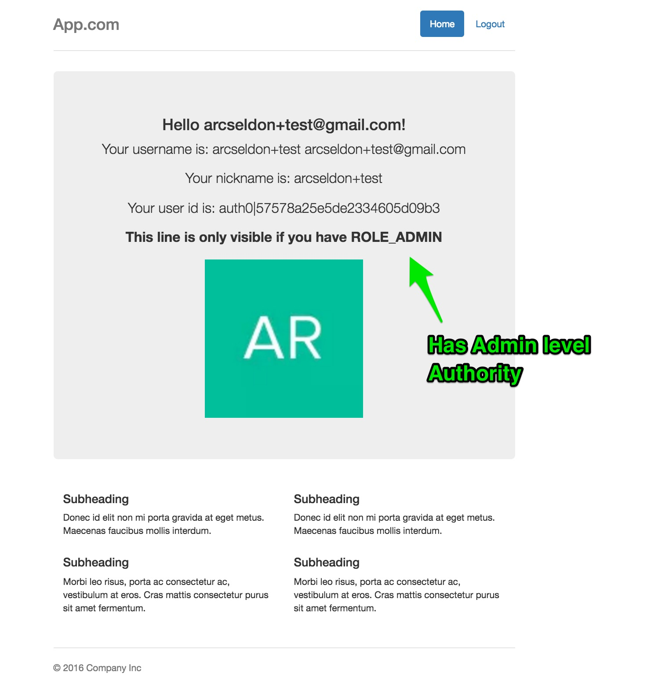

## Sample application demonstrating Auth0 and spring security integration for a Java Spring MVC application

This is a companion sample for the [Auth0 Spring Security MVC](https://github.com/auth0/auth0-spring-security-mvc) library.
Please refer to that library and documentation for further information specific to the library itself.

This sample application shows you how to:

 1. Configure and run Java based Spring application with Auth0 (Lock or Auth0.js) and Spring Security
 2. 100% Java Configuration (Annotations)
 3. Secure one or more URL endpoints with Role / Authority based permissions (ROLE_USER, ROLE_ADMIN etc)
 4. Secure Java Services using method level security annotations for role based access control
 5. Use Spring Security JSTL tag library to add role level security to your JSP pages.


In addition to this sample for Auth0 and Spring Security integration, if you are additionally interested in
having Single Sign-On (SSO) between Java Spring Security configured applications, then please take a look
at our [auth0-spring-security-mvc-sso-sample](https://github.com/auth0-samples/auth0-spring-security-mvc-sso-sample)

Let's get started - it only takes a few minutes to have a working application with all the above.

### Prerequisites

In order to run this example you will need to have Java 7+ and Maven installed.

Check that your maven version is 3.0.x or above:

```sh
mvn -v
```

### Setup

Create an [Auth0 Account](https://auth0.com) (if not already done so - free!).


#### From the Auth0 Dashboard

Create an application - for the purposes of this sample - `app`

Ensure you add the following to the settings.

Allowed Callback URL:

```
http://localhost:3099/callback
```

Ensure you add the following to the settings.

Allowed Logout URLs:

```
http://localhost:3099/logout
```

Add one or more `connections` to your application - for instance Google Social Connection,
or username-password DB connection.


###### Add Role Based Authorization By Creating an Auth0 Rule


Since this sample applies Role based authorization on the Home Page (defaults to requiring `ROLE_ADMIN`), go to `Rules`
and create the following new Rule:

```
function (user, context, callback) {
  user.app_metadata = user.app_metadata || {};
  // You can add a Role based on what you want
  // Here, we simply check domain
  var addRolesToUser = function(user, cb) {
    if (user.email.indexOf('@gmail.com') > -1) {
      cb(null, ['ROLE_ADMIN']);
   } else if (user.email.indexOf('@auth0.com') > -1) {
      cb(null, ['ROLE_ADMIN']);
    } else {
      cb(null, ['ROLE_USER']);
    }
  };

  addRolesToUser(user, function(err, roles) {
    if (err) {
      callback(err);
    } else {
      user.app_metadata.roles = roles;
      auth0.users.updateAppMetadata(user.user_id, user.app_metadata)
        .then(function(){
          callback(null, user, context);
        })
        .catch(function(err){
          callback(err);
        });
    }
  });
}
```

In our simple Rule above, we add `ROLE_ADMIN` to any user profiles whose email addresses are `gmail.com` and `auth0.com` domains.
Otherwise, we only provide `ROLE_USER` role. Our Spring Security Sample app will read this information from the UserProfile and apply
the granted authorities when checking authorization access to secured endpoints configured with Role based permissions

Here is our sample `AppConfig` entry where we specify the endpoints security settings - defined in AppConfig.java


```
  // Apply the Authentication and Authorization Strategies your application endpoints require
        http
                .authorizeRequests()
                .antMatchers("/css/**", "/fonts/**", "/js/**", "/login").permitAll()
                .antMatchers("/portal/**").hasAnyAuthority("ROLE_USER", "ROLE_ADMIN")
//                .antMatchers("/portal/**").hasAuthority("ROLE_ADMIN")
                .antMatchers(getSecuredRoute()).authenticated();
```

Here, we only allow users with `ROLE_USER` or `ROLE_ADMIN` to access the home page.


### Inside the Application - update configuration information

Enter your:

`client_id`, `client_secret`, and `domain` information into `src/main/resources/auth0.properties`

Note: There are two properties in `auth0.properties` that you do not need to touch. Leave values as `false`

`auth0.servletFilterEnabled: false` - this ensures we don't autowire the ServletFilter defined in an Auth0 dependency
library.

`auth0.defaultAuth0WebSecurityEnabled: false` - this ensures we do not autowire the default configuration file
provided with the `auth0-spring-security-mvc` library itself. That is a default configuration suitable only for
simpler applications seeking to have an out of the box secured endpoint URL - similar to `auth0-servlet` library.

For details on the other settings, please check the README for the library this sample depends on  [Auth0 Spring Security MVC](https://github.com/auth0/auth0-spring-security-mvc).
In particular, [this section on defalut configuration](https://github.com/auth0/auth0-spring-security-mvc#default-configuration) which lists each property together with a
description on its purpose.

### Build and Run

In order to build and run the project execute:

```sh
mvn spring-boot:run
```

Then, go to [http://localhost:3099/login](http://localhost:3099/login).

---

### Screenshots of the overall flow (minus growler notifications):


#### 1.Login


#### 2. Home - logged in user has ROLE_USER level authority


#### 3. Home -  logged in user has ROLE_ADMIN level authority



---


## License

The MIT License (MIT)

Copyright (c) 2013 AUTH10 LLC

Permission is hereby granted, free of charge, to any person obtaining a copy
of this software and associated documentation files (the "Software"), to deal
in the Software without restriction, including without limitation the rights
to use, copy, modify, merge, publish, distribute, sublicense, and/or sell
copies of the Software, and to permit persons to whom the Software is
furnished to do so, subject to the following conditions:

The above copyright notice and this permission notice shall be included in
all copies or substantial portions of the Software.

THE SOFTWARE IS PROVIDED "AS IS", WITHOUT WARRANTY OF ANY KIND, EXPRESS OR
IMPLIED, INCLUDING BUT NOT LIMITED TO THE WARRANTIES OF MERCHANTABILITY,
FITNESS FOR A PARTICULAR PURPOSE AND NONINFRINGEMENT. IN NO EVENT SHALL THE
AUTHORS OR COPYRIGHT HOLDERS BE LIABLE FOR ANY CLAIM, DAMAGES OR OTHER
LIABILITY, WHETHER IN AN ACTION OF CONTRACT, TORT OR OTHERWISE, ARISING FROM,
OUT OF OR IN CONNECTION WITH THE SOFTWARE OR THE USE OR OTHER DEALINGS IN
THE SOFTWARE.
