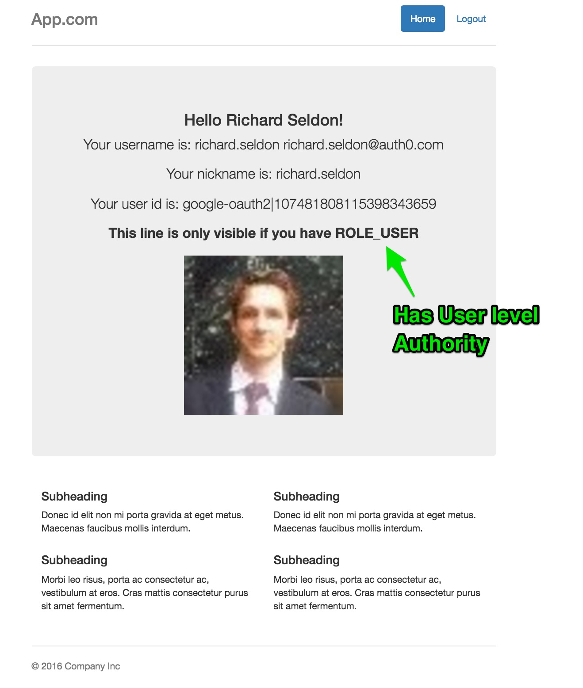

## Simple Application demonstrating Auth0 Lock login and home page using Spring Security

### Prerequisites

In order to run this example you will need to have Java 7+ and Maven installed.

Check that your maven version is 3.0.x or above:

```sh
mvn -v
```

### Setup

Create an [Auth0 Account](https://auth0.com) (if not already done so - free!).


#### From the Auth0 Dashboard

Create an application - for the purposes of this sample - `app`

Ensure you add the following to the settings.

Allowed Callback URL:

```
http://localhost:3099/callback
```

Ensure you add the following to the settings.

Allowed Logout URLs:

```
http://localhost:3099/logout
```

Add one or more `connections` to your application - for instance Google Social Connection,
or username-password DB connection.


### Inside the Application - update configuration information

Enter your:

`client_id`, `client_secret`, and `domain` information into `src/main/resources/auth0.properties`


### Build and Run

In order to build and run the project execute:

```sh
mvn spring-boot:run
```

Then, go to [http://localhost:3099/login](http://localhost:3099/login).

---

### Screenshots of the overall flow (minus growler notifications):


#### 1.Login


#### 2. Home




---


## License

The MIT License (MIT)

Copyright (c) 2013 AUTH10 LLC

Permission is hereby granted, free of charge, to any person obtaining a copy
of this software and associated documentation files (the "Software"), to deal
in the Software without restriction, including without limitation the rights
to use, copy, modify, merge, publish, distribute, sublicense, and/or sell
copies of the Software, and to permit persons to whom the Software is
furnished to do so, subject to the following conditions:

The above copyright notice and this permission notice shall be included in
all copies or substantial portions of the Software.

THE SOFTWARE IS PROVIDED "AS IS", WITHOUT WARRANTY OF ANY KIND, EXPRESS OR
IMPLIED, INCLUDING BUT NOT LIMITED TO THE WARRANTIES OF MERCHANTABILITY,
FITNESS FOR A PARTICULAR PURPOSE AND NONINFRINGEMENT. IN NO EVENT SHALL THE
AUTHORS OR COPYRIGHT HOLDERS BE LIABLE FOR ANY CLAIM, DAMAGES OR OTHER
LIABILITY, WHETHER IN AN ACTION OF CONTRACT, TORT OR OTHERWISE, ARISING FROM,
OUT OF OR IN CONNECTION WITH THE SOFTWARE OR THE USE OR OTHER DEALINGS IN
THE SOFTWARE.
